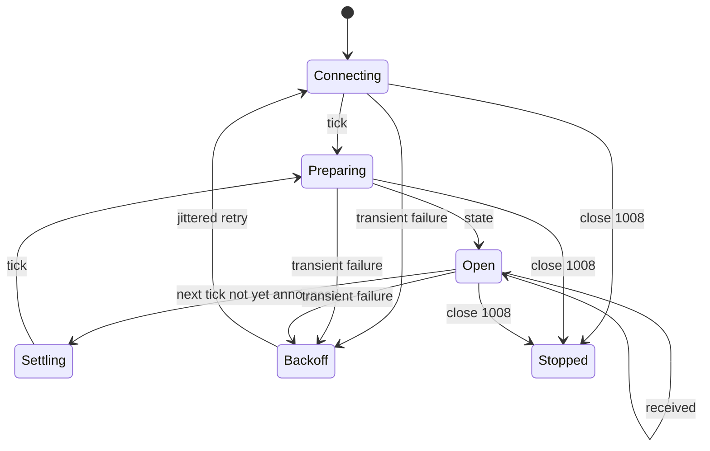

<!-- Generated from contract-aligned upstream sources by scripts/sync_references.py. -->

> Bundled from `arena-hero-doc` revision `531bfe1b05cef5adea97ebcf29314a5e5fae58ad`: `docs/agent/command-loop.md`.

# Reliable command loop

## State to keep

Track each of these separately:

```text
announced_tick
latest_state
latest_received.AGENT
latest_received.MANUAL
connection_phase
reconnect_attempt
obstacle_memory
resource_observation_memory
```

The connection will drop sooner or later. Holding the latest state and the latest
receipts on your side means that when it comes back you can swap them out
cleanly, rather than trying to work out what you missed. Keep obstacles and
resource observations separate: obstacles are permanent, while a natural point
or cargo pile may be consumed, partially recovered, or replenished while its
cell is outside vision.

## State machine



While a Tick is resolving the server may go quiet and send you no business
messages at all. That is expected, not a symptom of a broken connection —
protocol Ping/Pong is what tells your WebSocket library whether the socket is
still alive.

## Decision timing

There is one global 15-second window, and it opens before the server starts
publishing states. You never learn the exact deadline, and you may well get less
than the full 15 seconds.

So leave yourself room for the POST:

1. Build reusable indexes and strategy state outside the window.
2. Start calculating the moment `state` lands.
3. Hold yourself to an internal deadline well short of 15 seconds.
4. If the full strategy is running long, ship a simpler plan rather than miss the
   window.
5. Once you see `COMMAND_WINDOW_CLOSED`, stop and wait for the next state.

## Plan replacement

Suppose you submit this:

```json
{
  "tick": 80,
  "unit_actions": {
    "aaaaaaaa-aaaa-4aaa-8aaa-aaaaaaaaaaaa": {"type": "MOVE", "direction": "UP"},
    "bbbbbbbb-bbbb-4bbb-8bbb-bbbbbbbbbbbb": {"type": "WAIT"}
  }
}
```

and then follow it with this:

```json
{
  "tick": 80,
  "unit_actions": {
    "aaaaaaaa-aaaa-4aaa-8aaa-aaaaaaaaaaaa": {"type": "MOVE", "direction": "LEFT"}
  }
}
```

Unit B is no longer in your Agent plan at all. It resolves to `WAIT` unless
Manual supplies an action, because the second request replaces the first
wholesale — the server never merges the two or carries Unit B forward.

## Safe retry matrix

| Outcome | Retry? | Behavior |
|---|---|---|
| Network failed before a response | Yes | Retry the exact body with the same idempotency key. |
| `202 Accepted` | No | Wait for `received`; the plan is persisted. |
| Same key replay | No extra effect | Original response is returned; no duplicate `received`. |
| `TICK_NOT_READY` | Later | Wait for `state` or reconnect. |
| `COMMAND_WINDOW_CLOSED` | No for that Tick | Wait for the next `state`. |
| `TICK_MISMATCH` | Recompute | Never rewrite only the Tick number on stale state. |
| `INVALID_COMMAND` | Fix once | Correct the full plan; old valid plan remains active. |
| `COMMAND_RATE_LIMITED` | No for that source/Tick | Preserve the latest valid plan. |
| `UNAUTHORIZED` or WS `1008` | Stop | Replace the credential or fix the client before retrying. |

## Reconnect snapshot

Reconnect during OPEN and you get everything back, in this order:

1. the current `tick`;
2. the complete current `state`;
3. the latest `received` for `AGENT`, if there is one;
4. the latest `received` for `MANUAL`, if there is one.

Overwrite your local values with that snapshot. Note that reconnecting buys you
no extra time — the window keeps running on its own schedule.

Reconnect while states are still being prepared and you get `tick` right away,
then `state` when it is ready. Reconnect during settlement and the server stays
quiet until the next real Tick.

## Backoff

Start at 250 ms and double after each failure, up to a ceiling of 5 seconds, with
random jitter on top. Reset once a connection succeeds. Close code `1008` is
different: it means stop retrying until you have fixed the credential or the
behavior that caused it.

## Heartbeats

The server sends protocol Ping frames every 20 seconds and expects a Pong back
within 60. Standard WebSocket libraries handle this for you.

Do not invent a heartbeat JSON message. This socket rejects client business
frames, and sending one can get you closed with code `1008`.
